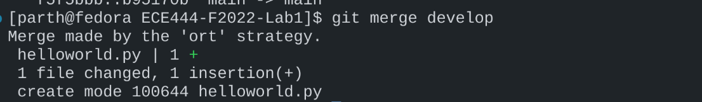
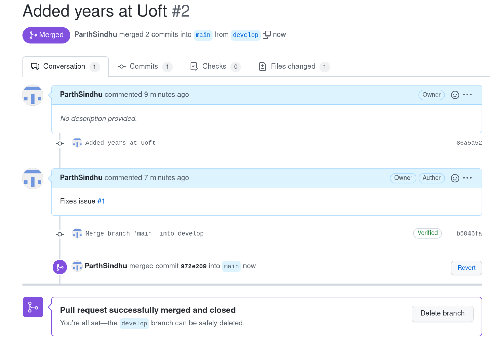
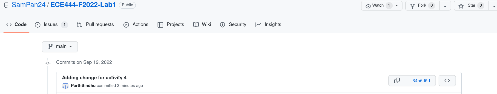
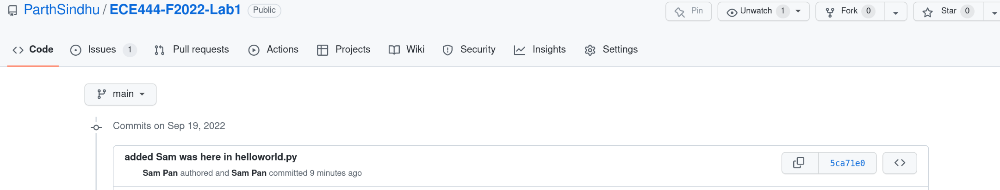
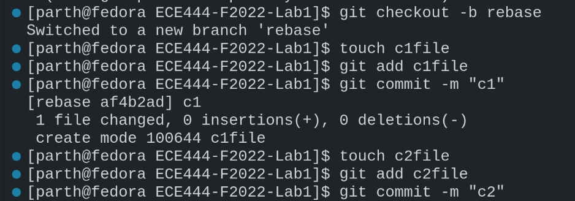
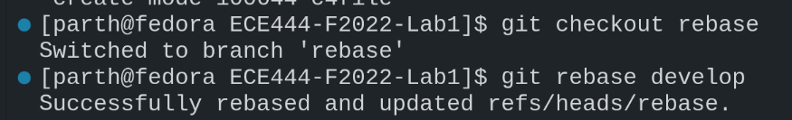
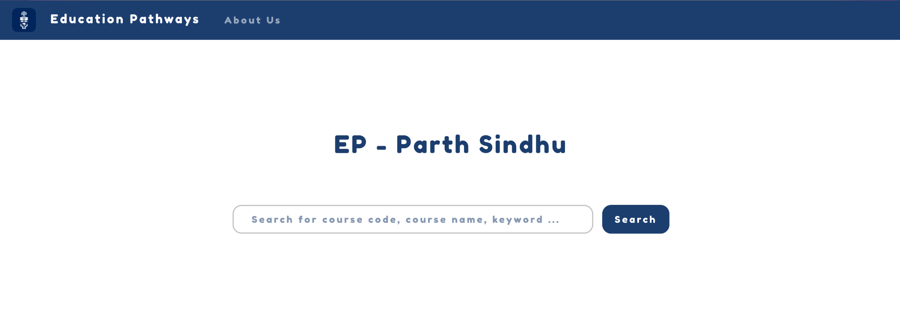
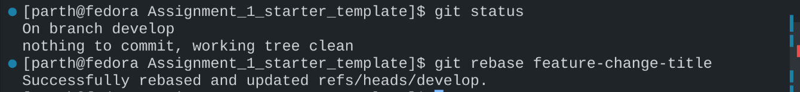

# Lab 1

Parth Sindhu

**Activity 1**

**Activity 2**

**Activity 3**

**Activity 4**

https://github.com/SamPan24/ECE444-F2022-Lab1

**Activity 5**

Making Commits in develop

Rebasing rebase branch

**Activity 6**

https://github.com/ParthSindhu/ECE444-F2022-EP

**Activity 7**

Screenshot of rebase command

**Activity 8**

[Screenshot of your rebase command]

