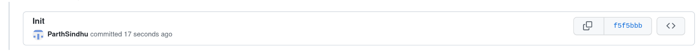

Parth Sindhu

**Activity 1**

**Activity 2**

**Activity 3**

**Activity 4**

[Link to your teammate's repo]

[Screenshot of the commit you made to your teammate's repo]

[Screenshot of the commit your teammate made to your repo]

**Activity 5**

[Screenshots of the commands that you used to rebase  along with their outpus]

**Activity 6**

[Link to your ECE444-F2022-Lab1-EP repo]

**Activity 7**

[Screenshot of your rebase command]

**Activity 8**

[Screenshot of your rebase command]
